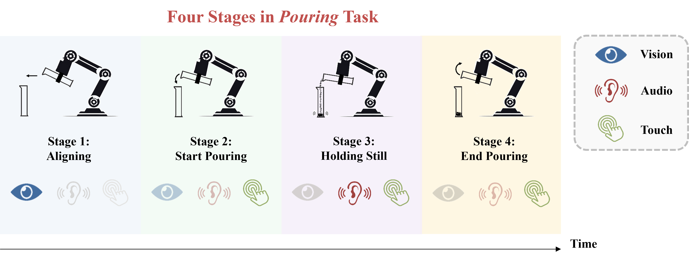
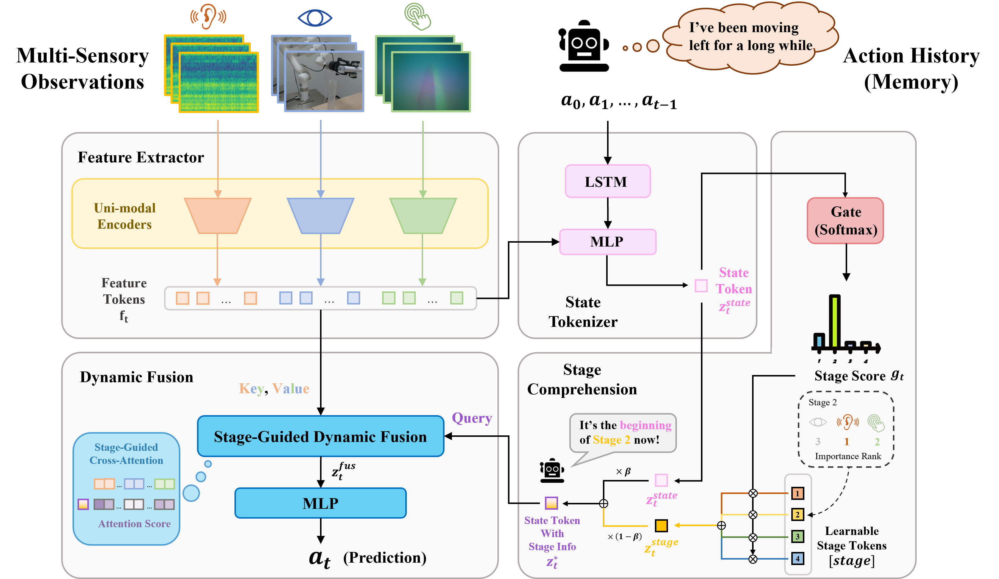

# Play to the Score: Stage-Guided Dynamic Multi-Sensory Fusion for Robotic Manipulation

The official PyTorch implementation for "*Play to the Score: Stage-Guided Dynamic Multi-Sensory Fusion for Robotic Manipulation*", CoRL 2024 (Oral)

**Authors: [Ruoxuan Feng](https://scholar.google.com/citations?user=Ma0FKqYAAAAJ&hl=en&oi=ao), [Di Hu](https://dtaoo.github.io/), [Wenke Ma](https://github.com/HANDS-FREE), [Xuelong Li](https://scholar.google.com/citations?user=ahUibskAAAAJ&hl=en&oi=ao)**

**Accepted by: Conference on Robot Learning (CoRL 2024, Oral Presentation)**

**Resources:[[Project Page](https://gewu-lab.github.io/MS-Bot/)],[[Arxiv](https://arxiv.org/abs/2408.01366v2)]**

If you have any questions, please open an issue or send an email to [fengruoxuan@ruc.edu.cn](mailto:fengruoxuan@ruc.edu.cn).

------

## Modality Temporality

<div align="center">    

</div>

In a complex manipulation task, **the importance of various uni-modal features could change over stages**. At timesteps from different stages, a particular modality may contribute significantly to the prediction, or serve as a supplementary role to the primary modality, or provide little useful information. Moreover, different states within a stage, such as the beginning and end, may also exhibit minor changes in modality importance. We distinguish them as coarse-grained and fine-grained importance change, and summarize this as a challenge in multi-sensory imitation learning: **Modality Temporality**.

## Method Introduction

To deal with the above challenge, we propose **MS-Bot**, a stage-guided **dynamic** multi-sensory fusion method with **coarse-to-fine stage understanding**. We first add a stage label for each sample, and then train the MS-Bot which consists of four components:

- **Feature Extractor:** This component consists of several uni-modal encoders and aims to extract uni-modal features.
- **State Tokenizer:** This component aims to encode the observations and action history into a token that can represent the current state.
- **Stage Comprehension Module:** This module aims to perform coarse-to-grained stage understanding by injecting stage information into the state token.
- **Dynamic Fusion Module:** This module aims to dynamically select the modalities of interest based on the fine-grained state within the current stage.

<div align="center">    

</div>

------

## Setup

This code is tested in Ubuntu 18.04, PyTorch 2.0.1, CUDA 11.7

**Install the requirements**

```
pip install -r requirements.txt
```

## Run

**Data Collection**

We provide an example code for data collection of two tasks in `collect/pour.py` and `collect/peg.py`. The collected data is located in `data/pour/*` and `data/peg/*`, respectively. Please ensure that the organization of your collected data matches the examples in the `data/` folder to ensure correct data processing.

**Data Processing**

To process the collected trajectories into multi-sensor paired data and add stage labels:

```
./script/preprocess_pour.sh
./script/preprocess_peg.sh
```

**Train**

To train the models:

```
nohup ./script/train_pour.sh > train_pour_log.txt &
nohup ./script/train_peg.sh > train_peg_log.txt &
```

**Inference**

We use a 6-DoF UFACTORY xArm 6 robot arm for real-world testing. If you are using a different robotic arm, please modify the control code accordingly. To run real-world testing:

```
./script/inference_pour.sh
./script/inference_peg.sh
```

------

## Citation

```
@inproceedings{feng2024play,
    title={Play to the Score: Stage-Guided Dynamic Multi-Sensory Fusion for Robotic Manipulation},
    author={Feng, Ruoxuan and Hu, Di and Ma, Wenke and Li, Xuelong},
    booktitle={8th Annual Conference on Robot Learning},
    year={2024},
    url={https://openreview.net/forum?id=N5IS6DzBmL}
}
```

